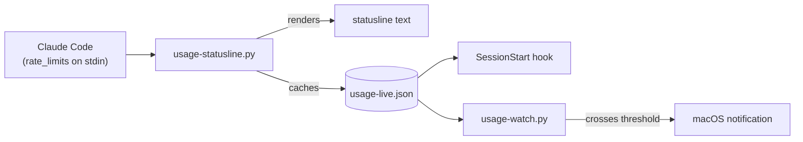

# claude-quota-gauge

Your real Claude Max quota %, in your terminal, straight from Claude Code
itself — no scraping, no stored credentials, no estimating for the two
numbers Anthropic actually reports.


Since Claude Code v2.1.80, the statusline command is fed a `rate_limits`
field on stdin — the exact 5-hour and weekly used-percentage Anthropic's own
backend reports, refreshed automatically every render. This tool reads that
field directly, caches it, and surfaces it two ways: in your statusline, and
injected into every new session's context automatically. Nothing here reads
your browser, touches an API key, or approximates anything — every number
shown is the same one `claude.ai/settings/usage` would show you, because
it's the same data, straight from Claude Code.

If your account also has a separate weekly pool for one model (Fable, on
Claude Max) that `rate_limits` doesn't break out, there's an optional
add-on for that too — see [Optional: per-model weekly tracking](#optional-per-model-weekly-tracking-eg-fable).
It's the one number in this tool that isn't straight from Anthropic's
backend; it's calibrated by hand against the real settings page once to
derive a weekly cap, then projected live from local usage against that cap,
but tracks closely enough that it's shown the same way as the two above it.


## Requirements

Claude Code **v2.1.80 or newer** (check with `claude --version`) — that's
the release where `rate_limits` was added to the statusline payload.
`install.sh` checks this for you and warns if you're on an older version;
either way, the statusline itself will say so plainly rather than guess.

## Quickstart

```bash
git clone https://github.com/rajanshxrma/claude-quota-gauge && cd claude-quota-gauge
./install.sh
```

The installer checks your Claude Code version, wires the statusline and
hooks into `~/.claude/settings.json` (asking first, and backing up your
existing settings), and walks you through one optional feature —
[pending tracking](#the-pendingmd-convention) — explaining what it is
before asking whether to turn it on (off by default either way). That's it —
no calibration step, nothing to read off a settings page by hand. Open
Claude Code and the statusline shows your real 5h/weekly % as soon as it
first renders, usually within a few seconds. If your account also has its
own weekly pool for one model (e.g. Fable), see
[Optional: per-model weekly tracking](#optional-per-model-weekly-tracking-eg-fable)
for a one-time opt-in step to track that too.

---

## How it works

1. **Claude Code hands the real numbers to the statusline command.** Every
   render, it feeds `usage-statusline.py` a JSON payload on stdin that
   includes `rate_limits.five_hour.used_percentage` and
   `rate_limits.seven_day.used_percentage` — Anthropic's own backend
   figures, not a local approximation.
2. **The script prints the statusline and caches those numbers to disk**
   (`~/.claude/scripts/usage-live.json`), so other things — the
   `SessionStart` hook, the background watcher — can read the latest known
   real values without needing that stdin payload themselves.
3. **A `SessionStart` hook injects the cached numbers into every new
   session's context** automatically. Nothing to run, nothing to trigger —
   it's just there.
4. **An optional `launchd` watcher** re-checks the cache periodically and
   fires a macOS notification when either number crosses a threshold.



## Model + effort in the bar

Every statusline render also leads with the current session's own active
model and reasoning effort — e.g. `opusplan→Sonnet 5 (high)` or `Fable 5
(xhigh/fast)` — read straight from the same stdin payload (`model.id`/
`display_name`, `effort.level`, `fast_mode`). If your `model` setting is
`opusplan`, that mode alternates the live model between Opus (plan phase)
and Sonnet (execution); the bar tags it as `opusplan→` on top of whichever
sub-model is actually live at that render, so the mode stays visible even
as the underlying model flips. The tag only appears when the live model is
one opusplan can actually produce (Opus or Sonnet) — a session-level
`/model` override to anything else takes that session out of opusplan mode,
and the bar shows the override bare rather than an impossible combination
like `opusplan→Fable 5`.

Claude Code invokes the statusline command separately per open session, so
if you have several terminals/tabs open on different models or effort
levels, each one's bar reflects only its own session — nothing to
configure to keep them straight.

## Resuming a session from the bar

The bar also trails with this session's own full `session_id` (the same
stdin payload carries it), e.g. `session: 71bb780d-80a5-46c3-9cfa-bf3a0e0fa4bc`.
If a long-running session gets close to a usage limit, copy that ID and run
`claude --resume <id>` in a fresh terminal window to pick it back up —
`--resume` needs the whole UUID, so a shortened prefix won't work.

## Configuration

`install.sh` copies `config/claude-quota-gauge.env.example` to
`~/.claude/claude-quota-gauge.env` for you (skipped if either that file or
the pre-0.7.0 `~/.claude/usage-calibrator.env` already exists — the old
name still works, it's just no longer the default). Uncomment what you
need — it's loaded automatically, including by the statusline command, the
`SessionStart` hook, and `launchd`, none of which see your shell profile.

| Variable | Default | What it does |
|---|---|---|
| `CLAUDE_USAGE_PENDING_FILE` | `./PENDING.md`, then `~/.claude/PENDING.md` | See the PENDING.md convention below |
| `CLAUDE_USAGE_TRACK_MODEL` | `fable` | Which model gets the optional calibrated weekly tracking — see below |
| `CLAUDE_USAGE_ALERT_THRESHOLD` | `85` | % that triggers a desktop notification |
| `CLAUDE_USAGE_THEME_WATCH` | unset (off) | macOS-only: flags UI theme staleness in the background — see below |

## The PENDING.md convention

A sibling to `CLAUDE.md`/`AGENTS.md`: a plain markdown file of parked issues,
one `## ` heading per item, written with enough detail that a cold session
can pick one up without re-deriving context. `usage-statusline.py` counts the
headings (excluding ones with "RESOLVED" in the title) and surfaces it as
`pending: N` in your statusline — a standing, ambient reminder that
something's still open. See `examples/PENDING.md` for the shape.

Off by default, on purpose — `pending: N` only appears once a `PENDING.md`
actually exists. `install.sh` walks you through this explicitly (explains
it in full, then asks) rather than either hiding it in the README or
turning it on unasked; decline and it stays off, exactly as designed.

Run `/pending <what's parked>` to add one from inside a Claude Code session —
it finds the right file (same resolution order as above), creates it from
the template if it doesn't exist yet, and inserts your item as a new
newest-on-top `## ` heading without touching anything already there.

## Optional: per-model weekly tracking (e.g. Fable)

`rate_limits` only exposes two real numbers: 5-hour and weekly-all-models.
If your account has its own separate weekly pool for one model — Fable, on
the Claude Max plan, has its own row on `claude.ai/settings/usage` distinct
from the shared pool — there's no API for that figure. This add-on fills
that one gap with a local, cost-weighted projection: one real read off the
settings page derives a weekly $ cap (`bin/usage-calibrate-fable.py`), and
`bin/tokens-since.py` then projects live local usage against that fixed cap
on every render — no re-scraping needed as usage accrues, and no browser
automation running in the background either.

It's shown in the statusline the same way as the two real numbers, with no
separate confidence label — the cost-weighting keeps it tracking closely.
Unlike the two real numbers, this one does need an occasional real read to
keep the cap itself honest (Anthropic's limit can change), so it reports
staleness explicitly rather than showing a number nobody could trust — but
only when there's genuine reason to distrust it: the cap hasn't been
re-verified in ~2 weeks, or the local projection blows past a sane
ceiling. Before a cap has ever been derived at all (e.g. right after
install, before you've used the tracked model this week), it doesn't show
an alarming `stale, run this command` message — same principle as the
5-hour/weekly-all numbers never showing a scary `unavailable` when a real
cached number is already known. It shows the honest number instead (`0%`,
since that's the only way a cap couldn't be derived yet) for exactly as
long as that stays true — the moment local transcripts show tracked-model
usage with no cap to project it against, it flags for one recalibration,
and that first non-zero read derives the cap and makes the number fully
live from then on.

The weekly window itself resets on its own with no browser read needed —
it advances to the real reset boundary Anthropic reports (the same one the
weekly-all-models number uses), so the projection naturally zeroes out
right after a rollover.

Setup, one time:

```bash
/gauge-cali-fable
```

This drives the browser to `claude.ai/settings/usage`, reads the real %
for whatever `CLAUDE_USAGE_TRACK_MODEL` is set to (default `fable`), and
derives the cap from it. Re-run it whenever the statusline reports it
stale, or occasionally to re-verify the cap — Claude does this on its own
once told to, since viewing a settings page has no side effects. A 0%
reading can't derive a cap (nothing used yet to calibrate against), so it
keeps whatever cap is already on file rather than discarding it.

## Optional: UI theme staleness (macOS only)

Claude Code's light/dark theme resolves once when a session launches and is
never hot-reloaded — if your OS appearance flips while a session sits open
(sleep/wake, a scheduled Dark Mode switch, or you just change it), that
session's colors silently go stale with no visible signal, and no external
process can re-apply the theme for you. The only supported mid-session fix
is running `/config theme=auto` yourself.

This add-on can't change that — nothing can — but it can catch the drift.
Set `CLAUDE_USAGE_THEME_WATCH=1` and a `UserPromptSubmit` hook
(`bin/theme-watch-prompt-hook.py`, wired by `install.sh`) checks the real OS
appearance against what the session's theme actually launched under, and
tells Claude in the background — never in the visible statusline bar — the
first time it notices a mismatch, so it can flag it to you unprompted. It
re-arms if the OS flips again, and stays quiet once the appearance matches
what the session launched under (or the session restarts) — there's no way
to see whether `/config theme=auto` actually ran, so it never assumes a fix
happened it can't verify.

## Optional: background watcher

`launchd/com.example.claude-usage-watch.plist.example` runs `usage-watch.py`
every 15 minutes and fires a native macOS notification when either number in
the cache crosses your threshold. It can only act on what's already cached,
though — the real numbers only arrive while a Claude Code session's
statusline is actively rendering, so if you go hours without opening Claude
Code, the watcher is alerting on the last real reading it has, not a live
one. It never estimates a number to fill the gap; it just tells you, always,
exactly what Claude Code last reported.

```bash
sed "s|__HOME__|$HOME|g; s|__PYTHON3__|$(command -v python3)|g" \
  launchd/com.example.claude-usage-watch.plist.example > ~/Library/LaunchAgents/com.claude-usage-watch.plist
launchctl load ~/Library/LaunchAgents/com.claude-usage-watch.plist
```

Not wired up by `install.sh` — the paths are machine-specific, so this is
opt-in and one command.

## Why I built this

I'm on the Max plan and kept getting surprised by the weekly cap mid-session
with zero warning. For a while this ran entirely on a cost-weighted local
estimate, calibrated by hand against `claude.ai/settings/usage` — it
worked, but it was an approximation with a manual step for every number.
Once Claude Code started handing the real percentage straight to the
statusline command, there was no reason to keep estimating the 5-hour and
weekly-all-models figures: those now show the exact same number the
settings page does, automatically, with nothing to calibrate. The old
estimate mechanism still earns its keep for the one number that has no
real API at all — a separate model's weekly pool (Fable) — but it's opt-in.

## What's not included, on purpose

- **A per-model weekly breakdown from Anthropic's own API** — `rate_limits`
  doesn't expose one, and there's no other API for it. "5-hour" and "weekly
  (all models)" are the only numbers that come straight from Anthropic's
  backend. An optional, opt-in calculation for one model is available (see
  above) for accounts with their own separate pool.
- **Email/push delivery** — the watcher uses stock macOS `osascript` only.
  No SMTP, no third-party notification service, nothing account-specific.
- **Stored credentials of any kind** — nothing here logs into `claude.ai`,
  stores a session cookie, or holds an API key. The only data source is the
  stdin payload Claude Code itself already sends to the statusline command
  you configured.
- **`launchd` auto-registration** — a template is provided, but `install.sh`
  won't load it for you; the Python interpreter path and your username are
  yours to fill in, one `sed` command, above.
- **Linux/Windows, today** — the scripts are plain Python and would run
  anywhere; only the notifier (`osascript`) and installer's hook-wiring
  assume macOS + `~/.claude/`. Not shipped, not tested.
- **Support for Claude Code < v2.1.80** — `rate_limits` doesn't exist on
  older versions. The statusline says so plainly rather than guessing.

## License

MIT — see [LICENSE](LICENSE).
