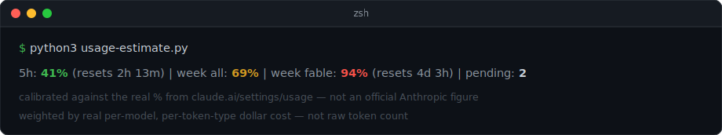
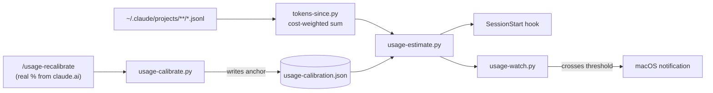

# claude-quota-gauge

Know how much of your Claude Max weekly quota you've actually burned — as a
live %, in your terminal, before you hit the wall.



Anthropic shows your real usage % in exactly one place: the claude.ai
settings page. No API, no statusline, no warning before you're throttled.
This reads your local session transcripts, weights them by real per-model
dollar cost (not raw token count), anchors once to the real number off the
settings page, and scales from there. Every new Claude Code session starts
already knowing your %. A background watcher pings you at 85%.


## Quickstart

```bash
npm install -g ccusage
git clone https://github.com/rajanshxrma/claude-quota-gauge && cd claude-quota-gauge
./install.sh
```

Then, once, read the three numbers off `claude.ai/settings/usage` and
calibrate — inside Claude Code, run `/usage-recalibrate` (it drives the
browser and does this for you), or by hand:

```bash
python3 ~/.claude/scripts/usage-calibrate.py <session_pct> <weekly_all_pct> <weekly_tracked_model_pct>
```

That's it. Open a new Claude Code session and your statusline already knows
your %.

---

## How it works

1. **Read local transcripts.** Every Claude Code session writes JSONL to
   `~/.claude/projects/**/*.jsonl`, including per-request token usage.
2. **Weight by real dollar cost, not raw token count.** Output tokens cost
   ~5x input on every current model, cache reads cost ~0.1x input, cache
   writes ~1.25x, and different models have completely different price
   points (Fable 5 is 2x Opus per token). Summing raw tokens 1:1 drifts from
   the real percentage the moment your mix of token types or models shifts —
   weighting by list price is a much closer proxy for whatever compute-cost
   metric actually drives the limit.
3. **Anchor once, manually.** There's no API for the real %, so you read it
   off the settings page and run `/usage-recalibrate` — this is the one
   unavoidable manual step, not a missing feature.
4. **Scale linearly from there.** Between calibrations, the estimate scales
   your cost-weighted local delta against the last real anchor.
5. **Surface it two ways:** a `SessionStart` hook injects the estimate into
   every new session's context, and an optional `launchd` watcher fires a
   macOS notification when any tracked % crosses a threshold.



## Why cost-weighting matters

Real example from today: the naive raw-token estimator read **78%** for
weekly usage. The real number, read straight off claude.ai/settings/usage,
was **69%** — a 9-point overestimate, purely from treating every token
category and every model as equally "expensive." Switching `tokens-since.py`
to weight by actual per-model, per-category dollar cost reproduced the real
number exactly on the next calibration. Meanwhile the per-model tracked %
(Fable, in this case) hadn't drifted at all in the same window — because its
own token-type mix happened to stay level. The bug was invisible until the
mix shifted; cost-weighting is what stops it from silently coming back.

## Configuration

Copy `config/usage-calibrator.env.example` to `~/.claude/usage-calibrator.env`
and uncomment what you need — it's loaded automatically, including by the
`SessionStart` hook and `launchd`, neither of which see your shell profile.

| Variable | Default | What it does |
|---|---|---|
| `CCUSAGE` | auto-detected | Path to the `ccusage` binary |
| `CLAUDE_USAGE_PENDING_FILE` | `./PENDING.md`, then `~/.claude/PENDING.md` | See the PENDING.md convention below |
| `CLAUDE_USAGE_TRACK_MODEL` | `fable` | Substring-matched model to track a separate weekly % for |
| `CLAUDE_USAGE_RESET_DAY` | `5` (Saturday) | Your account's real weekly reset day, `0`=Mon..`6`=Sun |
| `CLAUDE_USAGE_RESET_HOUR` | `5` | Reset hour, local time |
| `CLAUDE_USAGE_RESET_TZ` | `America/New_York` | IANA timezone for the reset |
| `CLAUDE_USAGE_ALERT_THRESHOLD` | `85` | % that triggers a desktop notification |

Your real reset day/hour/timezone is shown on the settings page next to the
weekly bar ("Resets \<day\> at \<time\>") — read it while you're already there
for calibration.

## The PENDING.md convention

A sibling to `CLAUDE.md`/`AGENTS.md`: a plain markdown file of parked issues,
one `## ` heading per item, written with enough detail that a cold session
can pick one up without re-deriving context. `usage-estimate.py` counts the
headings (excluding ones with "RESOLVED" in the title) and surfaces it as
`pending: N` in your statusline — a standing, ambient reminder that
something's still open. See `examples/PENDING.md` for the shape.

Run `/pending <what's parked>` to add one from inside a Claude Code session —
it finds the right file (same resolution order as above), creates it from
the template if it doesn't exist yet, and inserts your item as a new
newest-on-top `## ` heading without touching anything already there.
`install.sh` copies it to `~/.claude/commands/` alongside `/usage-recalibrate`.

## Optional: background watcher

`launchd/com.example.claude-usage-watch.plist.example` runs `usage-watch.py`
every 15 minutes and fires a native macOS notification when any tracked %
crosses your threshold — including "recalibration due" alerts when a window
rolls over, even with no Claude Code session open.

```bash
sed "s|__HOME__|$HOME|g; s|__PYTHON3__|$(command -v python3)|g" \
  launchd/com.example.claude-usage-watch.plist.example > ~/Library/LaunchAgents/com.claude-usage-watch.plist
launchctl load ~/Library/LaunchAgents/com.claude-usage-watch.plist
```

Not wired up by `install.sh` — the paths are machine-specific, so this is
opt-in and one command.

## Why I built this

I'm on the Max plan and kept getting surprised by the weekly cap mid-session
with zero warning. Anthropic doesn't publish a real quota % anywhere except
one web page you have to remember to check. This is the fix I actually use
every day — the SessionStart hook alone changed how I plan a work session.

## What's not included, on purpose

- **Email/push delivery** — the watcher uses stock macOS `osascript` only.
  No SMTP, no third-party notification service, nothing account-specific.
- **`launchd` auto-registration** — a template is provided, but `install.sh`
  won't load it for you; the Python interpreter path and your username are
  yours to fill in, one `sed` command, above.
- **Linux/Windows, today** — the estimator itself is plain Python and would
  run anywhere; only the notifier (`osascript`) and installer's hook-wiring
  assume macOS + `~/.claude/`. Not shipped, not tested.
- **A real API** — there isn't one. The one-time read off the settings page
  per calibration window is the tradeoff for having any live number at all.
- **Perfect accuracy between calibrations** — linear scaling assumes your
  token/model mix stays roughly constant since the last anchor. An unusually
  heavy stretch on one model will drift the estimate until you recalibrate.
- **Resilience to ccusage's output format changing** — calibration reads
  `ccusage`'s `blocks --json` shape directly; if that shape changes upstream,
  calibration breaks until this repo is updated.

## License

MIT — see [LICENSE](LICENSE).
