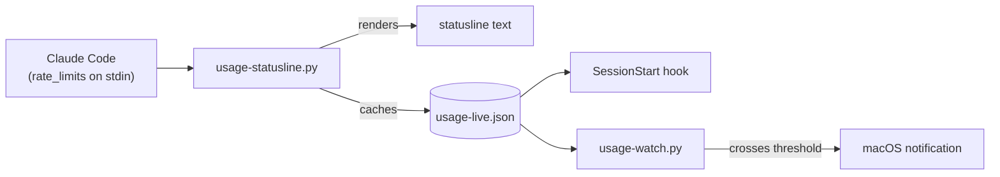

# claude-quota-gauge

Your real Claude Max quota %, in your terminal, straight from Claude Code
itself — no scraping, no browser automation, no stored credentials, no
estimating.


Since Claude Code v2.1.80, the statusline command is fed a `rate_limits`
field on stdin — the exact 5-hour and weekly used-percentage Anthropic's own
backend reports, refreshed automatically every render. This tool reads that
field directly, caches it, and surfaces it two ways: in your statusline, and
injected into every new session's context automatically. Nothing here reads
your browser, touches an API key, or approximates anything — every number
shown is the same one `claude.ai/settings/usage` would show you, because
it's the same data, straight from Claude Code.


## Requirements

Claude Code **v2.1.80 or newer** (check with `claude --version`) — that's
the release where `rate_limits` was added to the statusline payload. On an
older version, the statusline will say so plainly rather than guess.

## Quickstart

```bash
git clone https://github.com/rajanshxrma/claude-quota-gauge && cd claude-quota-gauge
./install.sh
```

That's it — no calibration step, nothing to read off a settings page by
hand. Open Claude Code and the statusline shows your real 5h/weekly % as
soon as it first renders, usually within a few seconds.

---

## How it works

1. **Claude Code hands the real numbers to the statusline command.** Every
   render, it feeds `usage-statusline.py` a JSON payload on stdin that
   includes `rate_limits.five_hour.used_percentage` and
   `rate_limits.seven_day.used_percentage` — Anthropic's own backend
   figures, not a local approximation.
2. **The script prints the statusline and caches those numbers to disk**
   (`~/.claude/scripts/usage-live.json`), so other things — the
   `SessionStart` hook, the background watcher — can read the latest known
   real values without needing that stdin payload themselves.
3. **A `SessionStart` hook injects the cached numbers into every new
   session's context** automatically. Nothing to run, nothing to trigger —
   it's just there.
4. **An optional `launchd` watcher** re-checks the cache periodically and
   fires a macOS notification when either number crosses a threshold.



## Configuration

Copy `config/usage-calibrator.env.example` to `~/.claude/usage-calibrator.env`
and uncomment what you need — it's loaded automatically, including by the
statusline command, the `SessionStart` hook, and `launchd`, none of which
see your shell profile.

| Variable | Default | What it does |
|---|---|---|
| `CLAUDE_USAGE_PENDING_FILE` | `./PENDING.md`, then `~/.claude/PENDING.md` | See the PENDING.md convention below |
| `CLAUDE_USAGE_ALERT_THRESHOLD` | `85` | % that triggers a desktop notification |

## The PENDING.md convention

A sibling to `CLAUDE.md`/`AGENTS.md`: a plain markdown file of parked issues,
one `## ` heading per item, written with enough detail that a cold session
can pick one up without re-deriving context. `usage-statusline.py` counts the
headings (excluding ones with "RESOLVED" in the title) and surfaces it as
`pending: N` in your statusline — a standing, ambient reminder that
something's still open. See `examples/PENDING.md` for the shape.

Run `/pending <what's parked>` to add one from inside a Claude Code session —
it finds the right file (same resolution order as above), creates it from
the template if it doesn't exist yet, and inserts your item as a new
newest-on-top `## ` heading without touching anything already there.

## Optional: background watcher

`launchd/com.example.claude-usage-watch.plist.example` runs `usage-watch.py`
every 15 minutes and fires a native macOS notification when either number in
the cache crosses your threshold. It can only act on what's already cached,
though — the real numbers only arrive while a Claude Code session's
statusline is actively rendering, so if you go hours without opening Claude
Code, the watcher is alerting on the last real reading it has, not a live
one. It never estimates a number to fill the gap; it just tells you, always,
exactly what Claude Code last reported.

```bash
sed "s|__HOME__|$HOME|g; s|__PYTHON3__|$(command -v python3)|g" \
  launchd/com.example.claude-usage-watch.plist.example > ~/Library/LaunchAgents/com.claude-usage-watch.plist
launchctl load ~/Library/LaunchAgents/com.claude-usage-watch.plist
```

Not wired up by `install.sh` — the paths are machine-specific, so this is
opt-in and one command.

## Why I built this

I'm on the Max plan and kept getting surprised by the weekly cap mid-session
with zero warning. For a while this ran on a cost-weighted local estimate,
calibrated by hand against `claude.ai/settings/usage` — it worked, but it
was an approximation with a manual step. Once Claude Code started handing
the real percentage straight to the statusline command, there was no reason
to keep estimating: this now shows the exact same number the settings page
does, automatically, with nothing to calibrate.

## What's not included, on purpose

- **A per-model weekly breakdown** — Anthropic doesn't expose one anywhere,
  including through `rate_limits`. Only "5-hour" and "weekly (all models)"
  are real, verifiable numbers, so those are the only two shown. No
  estimated substitute is shown in their place.
- **Email/push delivery** — the watcher uses stock macOS `osascript` only.
  No SMTP, no third-party notification service, nothing account-specific.
- **Stored credentials of any kind** — nothing here logs into `claude.ai`,
  stores a session cookie, or holds an API key. The only data source is the
  stdin payload Claude Code itself already sends to the statusline command
  you configured.
- **`launchd` auto-registration** — a template is provided, but `install.sh`
  won't load it for you; the Python interpreter path and your username are
  yours to fill in, one `sed` command, above.
- **Linux/Windows, today** — the scripts are plain Python and would run
  anywhere; only the notifier (`osascript`) and installer's hook-wiring
  assume macOS + `~/.claude/`. Not shipped, not tested.
- **Support for Claude Code < v2.1.80** — `rate_limits` doesn't exist on
  older versions. The statusline says so plainly rather than guessing.

## License

MIT — see [LICENSE](LICENSE).
